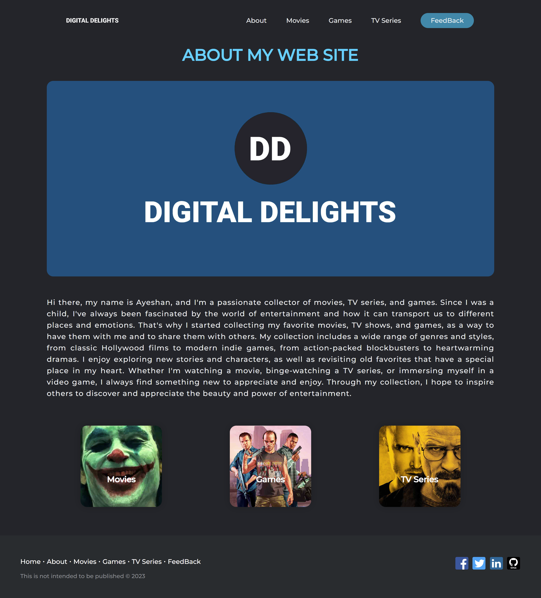
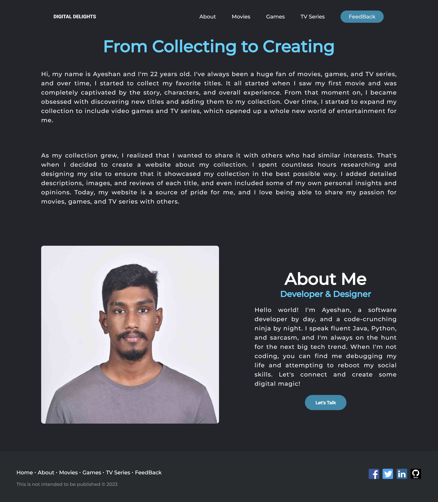
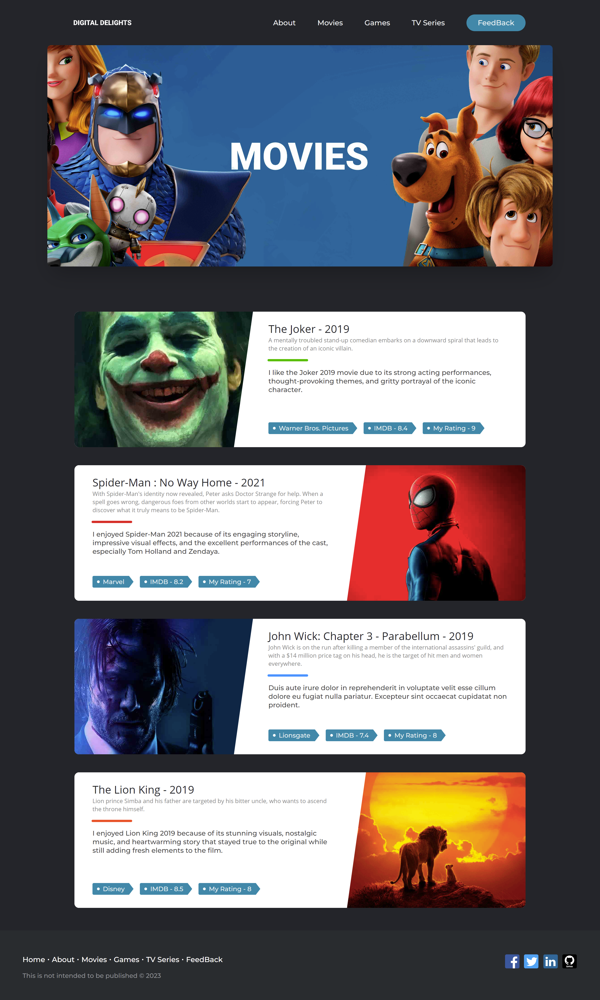
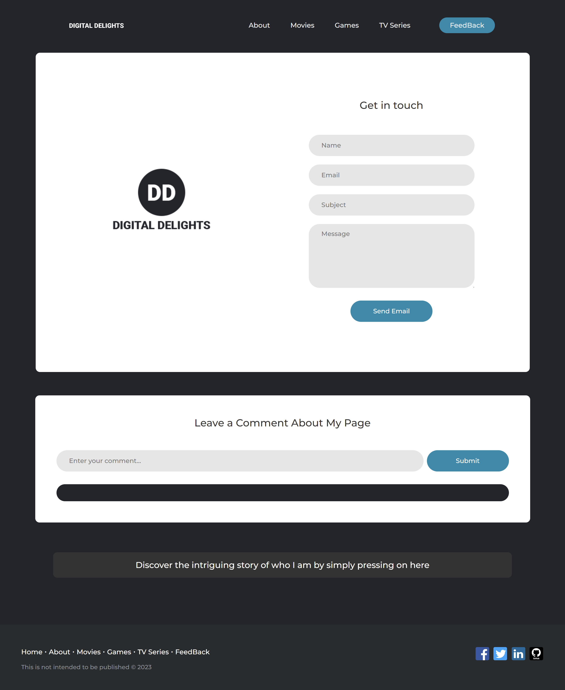

# Digital Delights

Welcome to Digital Delights, your go-to source for a curated collection of favorite games, movies, and TV series. This website is a reflection of my passion for entertainment, providing a platform to explore and share the gems that have captivated my interest.

## Table of Contents

- Home
- About
- Movies
- Games
- TV Series
- Feedback

## Screenshots

### Home Page

### About Page

### Movies Page

### Games Page

### TV Series Page

### Feedback Page

## Known Problems

- The site is currently not responsive for all screen sizes, providing an optimal experience only on desktop screens.
- The "Get in Touch" form is not connected to an email service, and thus, submissions are not being received.

## Copyright

I've developed this website solely for educational purposes, with no intention of publishing it. The images utilized on this site are sourced from platforms that distribute wallpapers, ensuring their personal use validity. However, any images for which I lack the authority to publish publicly will be promptly removed from this repository. Feel free to replace them with your own images.

Your feedback and contributions are highly appreciated. Enjoy exploring your Digital Delights!
